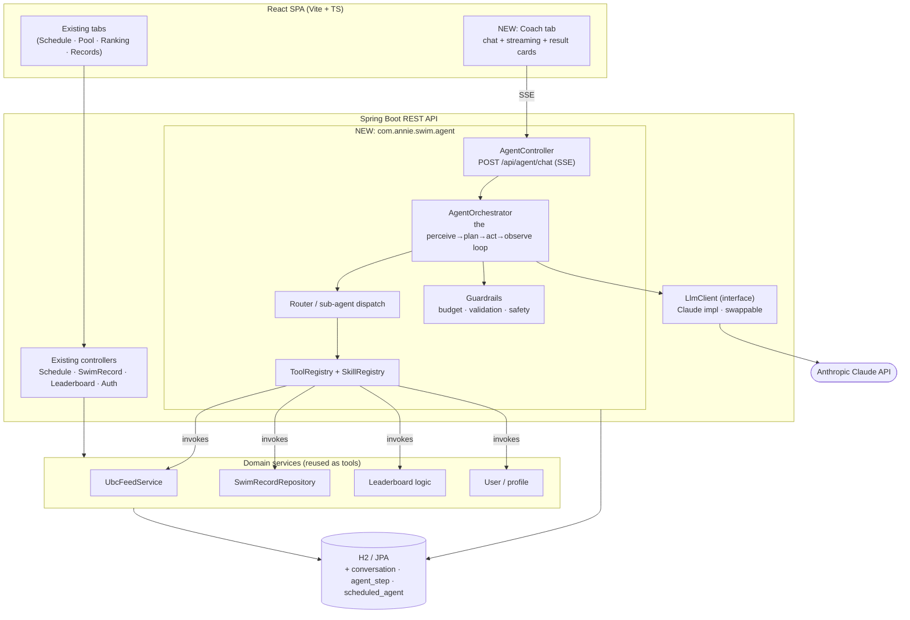
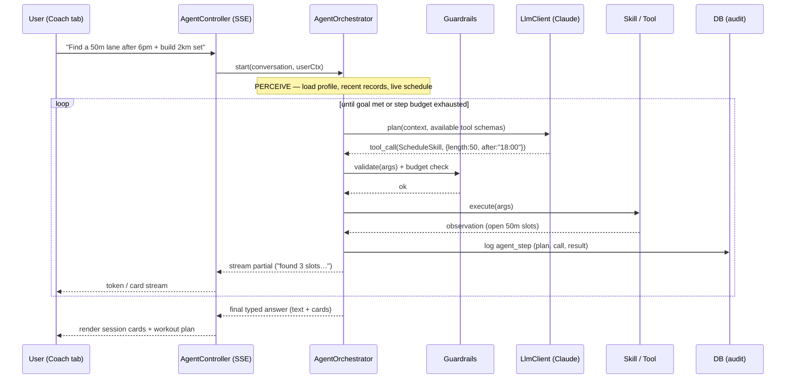
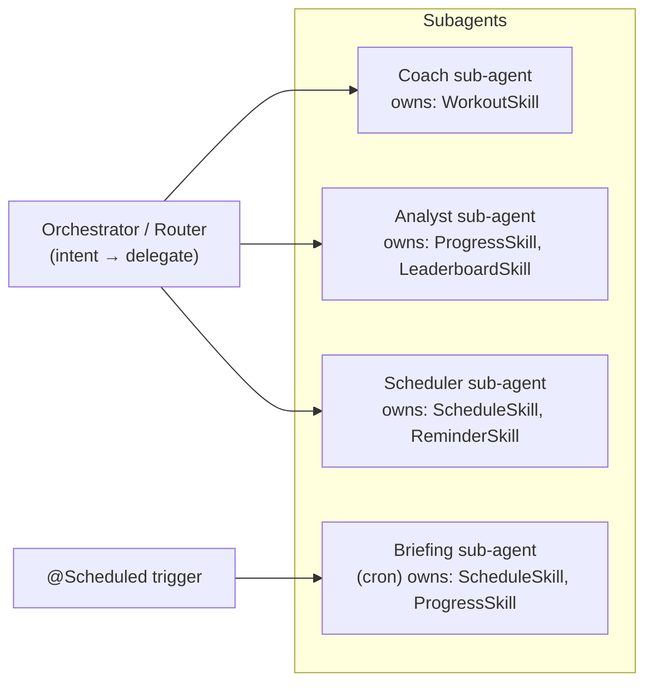
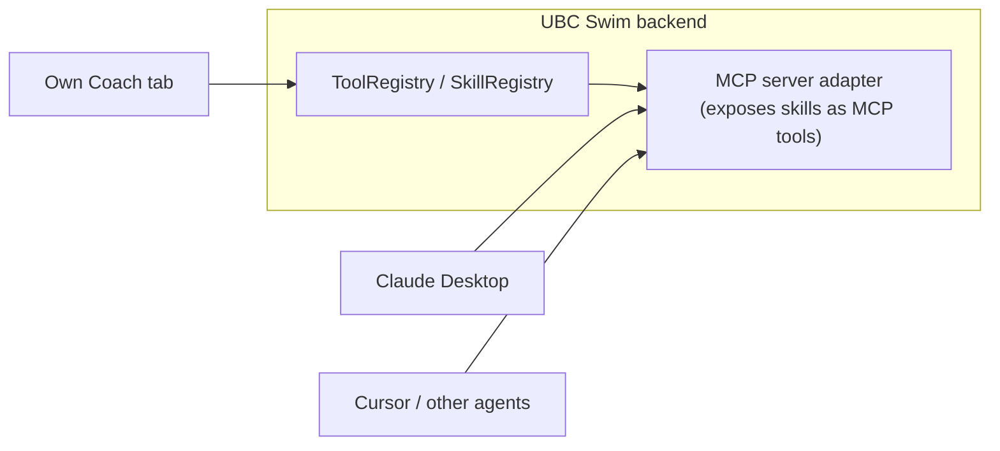

# Agentic Layer — Design Doc

> **Status:** Proposal / design sketch (nothing here is implemented yet).
> **Goal:** Add a conversational + autonomous "Swim Coach" agent to UBC Length Swim
> that orchestrates the app's *existing* capabilities, without rewriting the core.

---

## 1. Motivation

Today the app is a solid full-stack CRUD product: a React SPA over a Spring Boot
REST API that ingests the UBC Aquatic Centre schedule, lets users log swims, and
ranks a daily leaderboard. Everything is click-driven.

An **agentic layer** turns "click through tabs" into "just ask":

> *"Find me a 50 m lane after 6 pm this week and build a 2 km threshold set."*
> *"How's my volume trending vs last month?"*
> *"Remind me every Sunday which Length Swim slots are open."*

### Design principle

**The agent gets no new powers — it orchestrates the tools you already have.**
Every skill is a thin wrapper over an existing service (`UbcFeedService`,
`SwimRecordRepository`, leaderboard logic, user profile). This keeps the agent
thin, testable, safe, and cheap to extend.

---

## 2. High-level architecture



The agent lives entirely **inside the existing Spring Boot backend** as one new
package. It is guarded by a feature flag, so the app still builds and deploys
with the agent turned off — the CI/CD + single-branch deploy story is unchanged.

---

## 3. The agent loop

A classic **perceive → reason → act → observe** loop, running server-side and
streaming partial output to the client over Server-Sent Events.



**Guardrails** wrap every iteration:

- **Step budget** — hard cap on loop iterations / tool calls per turn.
- **Argument validation** — each tool call is checked against its JSON schema
  before execution.
- **Safety / domain constraints** — coaching, *not medical advice*; age-aware
  behaviour for minors; rate limiting per user.
- **Auditability** — every plan, tool call, and observation is persisted to
  `agent_step` for debugging and replay.

---

## 4. Skills — modular, drop-in capabilities

A **Skill** is a Spring bean implementing a tiny interface. The registry
auto-discovers all skill beans and exposes their metadata (name, description,
parameter schema) to the LLM. **Adding a capability = adding one class** — the
orchestrator never changes.

```java
public interface Skill {
    String name();                 // "schedule.find_sessions"
    String description();          // shown to the model for tool selection
    JsonSchema parameterSchema();  // validated before execute()
    SkillResult execute(SkillContext ctx, JsonNode args);
}
```

### Candidate skills (each wraps an existing service)

| Skill | What it does | Backed by |
|-------|--------------|-----------|
| **ScheduleSkill** | filter/search sessions, "next 50 m slot", detect openings | `UbcFeedService` |
| **WorkoutSkill** | generate a structured set (warm-up / main / cool-down) from level + goal | LLM + templates |
| **ProgressSkill** | weekly volume, PRs, streaks, trend lines over swim history | `SwimRecordRepository` |
| **LeaderboardSkill** | rank, compare to friends, motivational nudges | Leaderboard logic |
| **ReminderSkill** | schedule a notification / emit a calendar event | `scheduled_agent` table |
| **BookingSkill** *(future)* | reserve a lane (if UBC exposes an API) | external API |

Skills are independently unit-testable (mock the service, assert the result),
and the registry means the LLM's "toolbox" grows automatically.

---

## 5. Sub-agents — specialized delegates

An **Orchestrator/Router** classifies intent and delegates to focused
sub-agents, each owning a bundle of skills and its own small system prompt.
Small prompts + narrow tool sets = higher reliability and easier testing.



```java
public interface SubAgent {
    String name();                         // "coach"
    String systemPrompt();
    Set<String> skills();                  // skill names it may call
    boolean canHandle(Intent intent);
}
```

The **Briefing sub-agent** is the same machinery running autonomously: a
`@Scheduled` cron composes a "your Length Swim slots today" digest using the
same skills that power the interactive chat. One agent framework, two modes
(interactive + background).

---

## 6. Data model additions

| Table | Purpose |
|-------|---------|
| `conversation` | one row per chat thread (userId, createdAt, title) |
| `conversation_message` | user/assistant turns for context + history |
| `agent_step` | audit log: plan, tool name, args, result, latency, tokens |
| `scheduled_agent` | recurring agents (userId, cron, subAgent, params, enabled) |

`agent_step` doubles as an **observability layer** — you can replay any decision
the agent made, which is invaluable for debugging non-deterministic loops.

---

## 7. Frontend integration

- A new **Coach tab** sits alongside Schedule / Pool / Ranking / Records.
- Chat panel with **streaming** responses (SSE), suggestion chips, and a
  typed-output contract so the agent can return **structured cards** that reuse
  existing components (session cards, records, leaderboard rows, a workout plan).
- No redesign of the core app — the agent renders *into* the existing design
  system.

---

## 8. Extensibility & the MCP angle

- **Drop-in skills / sub-agents:** both are just beans; the registries wire
  them in at startup. New capability → new class → done.
- **Swappable model:** `LlmClient` is an interface; Claude today, anything
  tomorrow, configured in `application.properties`.
- **Feature-flagged:** `app.agent.enabled=false` keeps the core app fully
  functional and deployable without an LLM key.
- **MCP server *(stretch goal)*:** expose the same tool registry as a
  [Model Context Protocol](https://modelcontextprotocol.io) server so *external*
  agents (Claude Desktop, Cursor, etc.) can use "UBC Swim" as a tool. This turns
  the app from a product into a **platform**.



---

## 9. Suggested phasing

| Phase | Scope |
|-------|-------|
| **MVP** | single-agent loop · `ScheduleSkill` + `ProgressSkill` · Coach chat tab · SSE streaming · `agent_step` audit log · feature flag |
| **v2** | Orchestrator + sub-agents · `WorkoutSkill` · guardrails hardening · scheduled daily **Briefing** agent |
| **v3** | MCP server · `ReminderSkill` / calendar · per-user memory of goals & preferences |

---

## 10. Non-goals / risks

- **Not** a medical or safety-critical coach — advice is general fitness only,
  with explicit guardrails and age-appropriate behaviour.
- LLM calls are **non-deterministic and cost money** — hence the step budget,
  caching of tool results within a turn, and the feature flag.
- Keep tools **read-mostly** first; any write/booking action must be explicitly
  confirmed by the user before execution.

---

## 11. Why it's worth building

- **Usability:** natural-language *find + plan + remind* beats tab-clicking.
- **Extensibility:** skills/sub-agents are drop-in beans; the loop is stable.
- **Architecture story:** a tool/skill registry, sub-agent orchestration, an
  LLM abstraction, guardrails, an audit/observability layer, and an optional MCP
  integration — a genuinely differentiated, modern agentic system built on top
  of a clean REST core.
